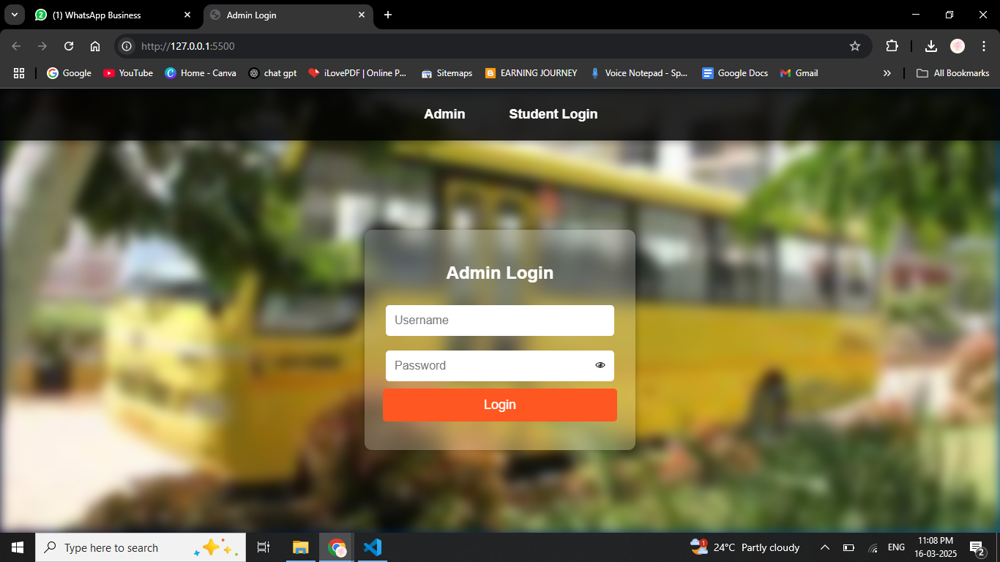

Bus Pass Management System

Overview
The **Bus Pass Management System** is a web-based application designed to simplify and automate the process of issuing and managing bus passes for passengers. This system eliminates the need for manual pass issuance, making the process more efficient and accessible.

Features
- User Registration & Login System
- Apply for a New Bus Pass
- Renewal of Existing Bus Pass
- Admin Dashboard for Pass Management
- Online Payment Integration
- Email Notifications for Pass Approval & Expiry Reminders
- Secure Database Management

Technologies Used
- Frontend: HTML, CSS, JavaScript
- Backend: Firebase Authentication & Firestore Database
- Hosting: Vercel

Installation & Setup
Prerequisites
- A modern web browser
- Internet connection
- Firebase project setup (for authentication and database management)

Steps to Run the Project
1. Clone the repository:
   git clone https://github.com/krihiga/bus-pass-management.git
   
2. Open the project folder and configure Firebase:
   - Set up Firebase Authentication
   - Configure Firestore Database
3. Run the project using a local server or deploy it on Vercel.

Usage
For Users:
  - Register/Login to the system
  - Apply for a bus pass by providing required details
  - Complete the payment (if applicable)
  - Download or print the generated pass

  For Admins:
  - Manage user applications
  - Approve, reject, or renew passes
  - Monitor pass issuance and database records

Contributing
Contributions are welcome! If you wish to improve this project, please fork the repository and submit a pull request.

License
This project is licensed under the Busy Order License.

Contact
For any inquiries or support, please reach out via **Busy Order**(https://www.busy-order.com/).

